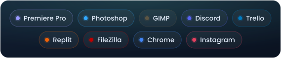

 

##  What I build

Small tools that remove some stupid friction I got tired of living with. Then I keep maintaining
them, which is the part nobody warns you about.

|  |  |
|:--:|---|
|  | **[browser-extensions](https://github.com/thomasthanos/browser-extensions)** Four Manifest V3 extensions for Chrome & Edge: NexusMods Bypass, An1me.to Tracker, Auto Liker and Speed Control. No trackers, no ads, no telemetry — full source published so you can verify that instead of taking my word for it. |
|  | **[Make_Your_Life_Easier.A.E](https://github.com/thomasthanos/Make_Your_Life_Easier.A.E)** All-in-one Windows desktop app: AES-256-GCM password manager, system tools (SFC, DISM, cleanup), one-click installer, auto-updates through GitHub Releases. |
|  | **[steam-idler](https://github.com/thomasthanos/steam-idler)** Steam achievement manager and game idler. Unlock or lock achievements, idle games, auto-invisible mode. |
|  | **[discord_package_viewer](https://github.com/thomasthanos/discord_package_viewer)** Turns your Discord data export into a fully offline HTML viewer: message history, statistics, charts, word cloud and live search. No server, no dependencies. |

##  Stack

##  Apps I currently have open

Some of them are even for coding.

<picture>
  <source media="(prefers-color-scheme: dark)" srcset="https://raw.githubusercontent.com/thomasthanos/thomasthanos/output/github-snake-dark.svg" />
  <source media="(prefers-color-scheme: light)" srcset="https://raw.githubusercontent.com/thomasthanos/thomasthanos/output/github-snake.svg" />
  
</picture>

  

**12,000 people use something I made. 1 person follows me here. Perfect balance.**

