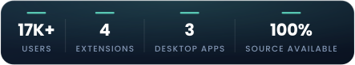
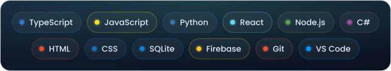

 

##  Featured Projects

<table>
<tr>
<td width="50%" valign="top">

**Browser Extensions**

Four Manifest V3 extensions for Chrome & Edge. No trackers, no ads, no telemetry.

`JavaScript` `CSS` · **12K+ users**

[→ View repository](https://github.com/thomasthanos/browser-extensions)

</td>
<td width="50%" valign="top">

**Make Your Life Easier**

Windows desktop toolkit: password manager, system tools, one-click installer.

`JavaScript` · **AES-256-GCM · auto-update**

[→ View repository](https://github.com/thomasthanos/Make_Your_Life_Easier.A.E)

</td>
</tr>
<tr>
<td width="50%" valign="top">

**Steam Idler**

Achievement manager and game idler. Unlock or lock achievements, idle games.

`TypeScript` · **Steam**

[→ View repository](https://github.com/thomasthanos/steam-idler)

</td>
<td width="50%" valign="top">

**Discord Package Viewer**

Turns a Discord data export into a fully offline HTML archive with search.

`Python` `HTML` · **no server**

[→ View repository](https://github.com/thomasthanos/discord_package_viewer)

</td>
</tr>
</table>

##  Tech Stack

##  Currently Building

**An1me.to Tracker** — Chrome extension for tracking episodes, resuming progress and catching
release updates.

**Windows utilities** — small desktop tools aimed at removing repetitive Windows chores.

**Experiments** — browser automation, Discord tooling, and things I probably started at 04:00.

##  GitHub Activity

<picture>
  <source media="(prefers-color-scheme: dark)" srcset="https://raw.githubusercontent.com/thomasthanos/thomasthanos/output/github-snake-dark.svg" />
  <source media="(prefers-color-scheme: light)" srcset="https://raw.githubusercontent.com/thomasthanos/thomasthanos/output/github-snake.svg" />
  
</picture>

<b>12,000 people use something I made. 1 person follows me here. Perfect balance.</b>

